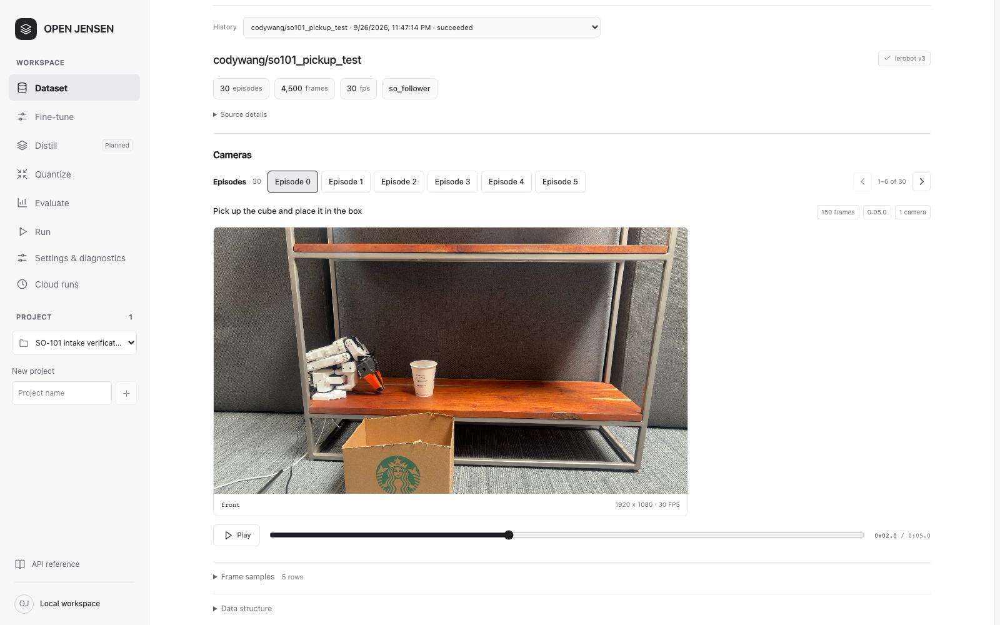
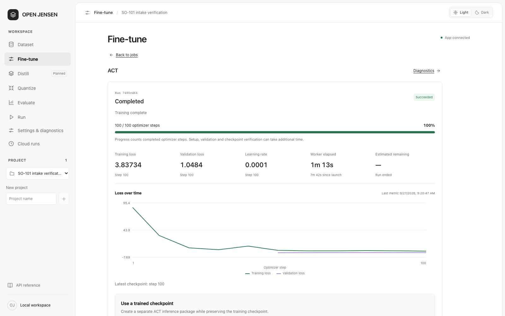
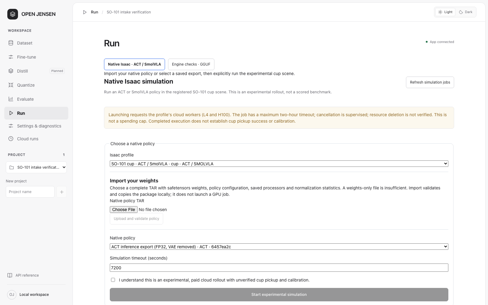

# OPEN JENSEN

**Joint Embodied Neural Simulation & Execution Network**

**Inspect robot data, train policies, and prepare models for native inference.**

OPEN JENSEN brings dataset exploration, training, quantization and simulation into one self-hosted workspace. The web app, CLI and optional terminal client share the same projects, jobs and artifacts. Training and simulation run in separate worker environments, locally or on configured cloud compute.

Built at the Firebird hackathon.

[Get started](#run-locally) · [Workspace guide](docs/workspace-guide.md) · [Product status](#current-status) · [Documentation](#documentation) · [Development](#development)



*Browse recorded episodes and inspect their camera views, state and action samples.*

## What you can do

| Sector | In the workspace |
| --- | --- |
| Dataset | Inspect public LeRobot v2/v3 datasets, play camera recordings and review sampled state/action rows. Validate local v3 datasets into immutable training copies. |
| Fine-tune | Choose a policy and compatible compute, follow loss and progress, resume supported runs, and download checkpoints with their recipes and provenance. |
| Distill | Train a student to imitate a teacher using a supported model adapter. Currently only ACT (Action Chunking with Transformers) → ACT256 is implemented, with compatible observations/actions and explicit episode splits; other model families are unavailable. |
| Quantize | Convert SmolVLA checkpoints to GGUF with Q8 or experimental Q4 language-weight quantization. Export completed ACT checkpoints as FP32 inference packages, then create packed INT8/INT4 ACT candidates with fresh CPU reload checks. |
| Evaluate / Run | Measure native inference, inspect full packed ACT predictions on recorded observations, run configured LIBERO evaluations, or launch an experimental ACT/SmolVLA Isaac simulation. |
| Teaching / Augmentation | Record demonstrations through the Teaching interface, connect optional voice services, or review appearance-augmentation candidates before reusing them. |
| Decision lab | Compare text criteria with the configured local Muose scorer. Results are uncalibrated advice and never execute actions. |
| Cloud runs / Settings | Review saved cloud activity, configure connections and compute, and inspect project diagnostics. |

Each operation has its own model, dataset and runtime requirements. The interface shows configured capabilities; a registered adapter does not mean every model has completed a GPU run.

[OPEN JENSEN Quant](workers/firebird_quant/README.md) is a 4/8-bit quantization library and CLI for dense PyTorch models. Its native ACT packing path is integrated with the workspace; broader library support does not imply every architecture has an application adapter. Model quality and hardware speed need separate evaluation.

## Inside the workspace



*A saved ACT training run with reported losses and checkpoint status. Training completion and reload verification are separate from robot task performance.*



*Native Isaac setup uses an explicit policy package and configured runner. Cup-task scoring remains unavailable while calibration and success criteria are unresolved.*

These are dated captures of the product interface, not generated mockups. They predate the current navigation and minimal page layout; use the [workspace guide](docs/workspace-guide.md) for current controls. Capture details are in the [screenshot notes](docs/images/README.md).

## Current status

OPEN JENSEN is a development preview. The repository includes real GPU execution records as well as software and integration tests. Their scope differs:

| Area | Current evidence and limits |
| --- | --- |
| Training | **15 registered policy routes.** SmolVLA LoRA and ACT have completed recorded NVIDIA L4 training runs and fresh-process checkpoint reloads. Other routes have configuration, dependency or contract checks; GPU acceptance remains model-specific. |
| SmolVLA quantization | A trained checkpoint has completed GGUF conversion, Q4 packing and native execution. **Q8 is the default; Q4 is experimental.** These checks do not establish retained task quality for a new policy. |
| Evaluate and Run | Recorded cloud SmolVLA checks exercise real CUDA inference and package reloads with synthetic inputs. Configured LIBERO can measure benchmark outcomes; the newer integrated Spatial workflow still awaits hardware acceptance. |
| ACT export | The supported final native checkpoint can be materialized and exported on CPU with action-chunk parity and reload checks. This is an inference export, not quantization. Local-dataset ACT export is not supported yet. |
| ACT distillation | The browser has submitted a real local ACT→ACT256 training job, registered the fresh-reloaded student and downloaded it. The verified example uses generated observations and demonstrates software execution, not learned robot competence. SmolVLA and cross-family distillation remain planned. |
| Native ACT packing and replay | INT8/INT4 policies have returned full 100×6 action chunks through fresh CPU workers, including reset checks. The application can replay explicitly selected immutable observations and display saved action traces. Stored-weight compression does not establish lower runtime memory, faster execution, task success or packed-policy Isaac support. |
| Native Isaac | ACT/SmolVLA package import, job controls, status and output handling are implemented. The web workflow has fixture coverage; live rollout acceptance and scored cup-pickup evaluation are separate work. |
| Teaching and augmentation | Recording and LeRobot writer/readback are implemented. Live voice-to-Isaac acceptance and live augmentation quality remain unverified. Local teaching captures can train native LeRobot adapters; the dedicated SmolVLA and Psi-Zero routes still require Hub datasets. |
| Clients and extensions | The Textual client and Tauri desktop connector are implemented. Desktop requires a separately running backend. Unity is a receive-only viewer. Muose is advisory; Jev and Mk1.5 adapters are not connected to the control loop. |
| Planned | Broader distillation adapters, a bundled desktop backend, and verified physical-robot deployment. |

See the [cloud training record](docs/cloud-training-verification.md), [native inference record](docs/jobs-first-verification.md), and [native simulation scope](docs/native-simulation.md) for the experiments, inputs and remaining checks. A completed job, lower training loss or successful model conversion does not by itself establish task success.

## Run locally

Use the pinned toolchain: **Python 3.14.7**, **uv 0.12.19**, **Node 24.21.0** and **pnpm 12.6.0**. Node is needed to build or develop the frontend. The running application is served by Python.

The product is named OPEN JENSEN. The CLI remains `firebird`, and existing `FIREBIRD_*` configuration keys and workspace paths continue to work.

From the repository root:

```sh
uv sync --frozen
uv venv --python 3.14.7 workers/_cpu_readers/.venv
uv pip install --python workers/_cpu_readers/.venv/bin/python --no-deps pyarrow==25.0.1
pnpm install --frozen-lockfile
pnpm build:web
uv run --frozen firebird serve
```

Open [localhost:8000](http://127.0.0.1:8000). On Windows, use `workers/_cpu_readers/.venv/Scripts/python.exe` in the reader installation command.

The core application and metadata intake need no GPU or provider key. Public Hub inspection needs network access. Training, native inference, simulation, voice and augmentation need their own configured workers or services. The server binds to loopback; hosted authentication is not implemented.

For tool-version fallbacks, development mode, local dataset configuration and CLI examples, see the [getting started guide](docs/getting-started.md).

For native ACT distillation and packed observation replay, use the separate
[local CPU worker setup](workers/local_cpu/README.md). It installs isolated worker
environments and writes a new configuration only when explicitly requested; the
ordinary application setup above does not install model dependencies or activate
these workers. Native ACT quantization also needs its
[registered packing worker](workers/firebird_quant/NATIVE_ACT.md).

### Your first project

1. Create a project and open **Dataset → Sources**.
2. Choose the pinned **SO-101 pickup** or **SO-100 pick & place** starter and select **Inspect dataset**.
3. Open **Load visual preview** to browse episodes, camera recordings and sampled actions.
4. Connect Google Cloud in **Settings & diagnostics → Compute**, or enable an [installed local worker](docs/policy-workflow.md), then choose a compatible model and recipe in **Fine-tune**. Cloud jobs use your configured account.
5. Open the saved run to review progress, checkpoints and provenance. Use the supported export or quantization path for that model.

## Documentation

Start with the [workspace guide](docs/workspace-guide.md) for a short explanation of every sector. The app also serves it at [`/guide/`](http://127.0.0.1:8000/guide/) through the **Guide** link on desktop and mobile.

| Topic | Guides |
| --- | --- |
| Workspace | [Sector guide](docs/workspace-guide.md), [interface conventions](docs/workbench-design.md) |
| Setup and compute | [Getting started](docs/getting-started.md), [compute settings](docs/compute-settings.md), [cloud training](docs/skypilot-training.md) |
| Datasets | [Local training and Teaching](docs/local-training.md), [appearance augmentation](docs/augmentation.md), [source provenance](apps/web/public/datasets/README.md) |
| Policies and artifacts | [Training adapters](docs/native-training.md), [native policy workflow](docs/policy-workflow.md), [ACT export](docs/cloud-act-export.md), [ACT distillation](workers/policy_distillation/README.md), [cloud artifact storage](docs/cloud-artifact-storage.md) |
| Local optimization | [CPU worker setup](workers/local_cpu/README.md), [native ACT packing](workers/firebird_quant/NATIVE_ACT.md), [recorded-observation replay](workers/isaac_sim/NATIVE_REPLAY.md) |
| Evaluation and simulation | [Native Isaac](docs/native-simulation.md), [LIBERO Spatial](docs/spatial-workflow.md), [cloud inference](docs/cloud-inference.md), [cloud run monitoring](docs/cloud-runs.md) |
| Other clients | [Terminal workbench](docs/terminal.md), [desktop connector](apps/desktop/README.md), [Unity viewer](apps/unity/com.firebird.teaching-viewer/README.md) |
| Optional AI services | [Voice connections](docs/teaching-connections.md), [Muose decision worker](workers/decision/README.md), [Jev and Mk1.5 proposals](workers/teaching/PROVIDERS.md) |
| Verification | [Cloud training](docs/cloud-training-verification.md), [inference and package reload](docs/jobs-first-verification.md), [application integration](docs/integration-journey-validation.md), [CI and local checks](docs/ci.md) |

The separate [`/docs/`](http://127.0.0.1:8000/docs/) route serves the [API reference](http://127.0.0.1:8000/docs/) and [OpenAPI schema](http://127.0.0.1:8000/openapi.json).

## Architecture

The Python application owns persistent projects, job state and artifact records. Isolated workers own model-specific dependencies and execution. OPEN JENSEN adopts LeRobot, SkyPilot and native runtimes instead of maintaining a second implementation of each trainer or simulator.

```text
apps/web/          Next.js and React interface, exported as static files
packages/core/     Python API, CLI, optional TUI, SQLite and job orchestration
workers/           Isolated training, inference, simulation and data workers
apps/desktop/      Tauri connector to a separately running local application
apps/unity/        Receive-only simulation viewer
tests/             Core, worker-contract and browser integration checks
docs/              Setup guides, workflow boundaries and verification records
```

Project data lives in `.firebird/` by default. Set `FIREBIRD_DATA_DIR` to change it. One application process owns each workspace. Cloud training stores checkpoints in private GCS; explicit downloads and export operations can materialize them locally.

## Development

After installing the pinned dependencies:

```sh
uv run --frozen pytest -q
uv run --frozen ruff check packages/core scripts tests
uv run --frozen ruff format --check packages/core scripts tests
pnpm check:web
pnpm build:web
pnpm exec playwright install chromium
pnpm test:web
```

Workers keep separate environments and checks. Do not hand-edit generated API types. Follow the [CI guide](docs/ci.md) for optional terminal checks, schema generation, platform requirements and the full verification sequence.
