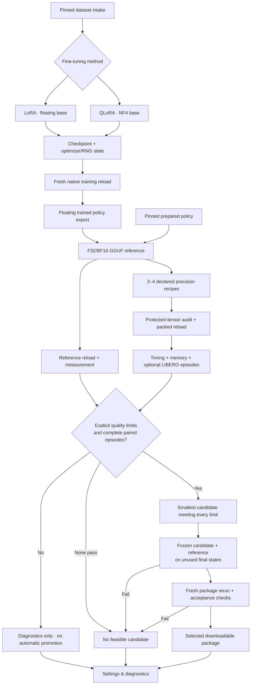

# Native policy workflow

Firebird owns the project, dataset intake, jobs, cancellation, progress, artifact
lineage and downloads. Python 3.11 workers own ML/native execution. The core stays
on Python 3.14 without Torch. Web and CLI submit the same versioned API requests.

In the sidebar, inspect a dataset, choose **Fine-tune → LoRA or QLoRA**, then choose
that checkpoint under **Quantize**. Quantize also accepts a prepared, pinned policy
source. **Evaluate** and **Run** accept the generated policy artifacts. Run creates
a downloadable package after a fresh native reload and the chosen evaluation.
**Distill** remains planned; it is not required by this supported path.

Metrics, recorded recipes, provenance and stage events are under
**Settings & diagnostics → Diagnostics**. Workflow pages show progress and outputs.
Settings also hold advanced recipes and acceptance constraints. Browser preferences
are per project; each job preserves the submitted recipe on the server.

Diagnostics also shows the completed GPU benchmark comparison as labelled reference
results, even before a project has policy runs. NVIDIA L4 (8 vCPUs / 32 GiB), NVIDIA
L4 (12 vCPUs / 48 GiB) and RTX 3070 have separate views, pinned to evidence commit
`e5866f0`. The L4 (8 vCPUs / 32 GiB) view
includes all ten candidates, process-to-first-action startup, cached runtime
initialization, sampled process VRAM, and paired success changes. Missing RTX runs
and VRAM appear as dashes. Labels contain only hardware details. These examples do
not populate project jobs or establish results for a new policy.

To run project diagnostics, select **Settings & diagnostics → Diagnostics**, choose
an execution target and a project GGUF policy, choose **Engine checks** or **LIBERO
task evaluation**, then click **Start diagnostics**. **Edit diagnostic settings**
opens the per-project warmup, repetitions, task and initial-state controls. Results,
status, stage events and cancellation are available under **Diagnostic runs**, and
completed runs remain visible after reload. A project without a GGUF policy links
to **Quantize** to create one. An unavailable API, missing runtime or missing
simulator is shown explicitly and blocks the relevant launch.

The application host must already have a working native worker configured through
`FIREBIRD_RUNTIME_CONFIG`; these controls do not provision GPUs. Registering a
target advertises its configuration, not a live hardware health check. Worker
startup failures are reported by the job. The retired benchmark rental and failed
RTX host are not available execution targets.

Project diagnostics evaluate **one native policy** using the application's protocol.
The application simulator uses **LIBERO Object**; the recorded comparison uses
**LIBERO Spatial**. These task scores must not be compared as the same benchmark.
They do not launch the ten-stack LeRobot/bitsandbytes/C++/vLLM/TensorRT-LLM comparison,
whose complete observation-to-action timing, process memory and paired fixture
contract differ. **Measurement scope & reproduction** in the example links to the
pinned standalone GPU benchmark setup and commands for reproducing that comparison.

## Defaults and selection

The starting recipe is **LM Q4_0 on CUDA**, **LM Q8_0 on CPU**, with vision left in
its source precision. These choices reflect the small existing target-specific
pilots, not a universal quality claim. Vision Q8 is an explicit experimental option.
Fine-tuning defaults to **LoRA**; **QLoRA** uses the same adapter training path over
an NF4 base. The method registry can grow without making QLoRA mandatory.



Engine diagnostics use synthetic inputs to test loading, finite actions, per-call
latency and memory. They never establish task success. LIBERO requires the explicit
`libero_object`/7-action compatibility declaration and a prepared simulator. An
SO-101 training dataset is not automatically compatible with LIBERO. Simulator
training overlap is not audited, and selected results describe only the requested
protocol, not robot readiness.

For automatic selection, enable paired LIBERO episodes and specify quality,
latency and memory limits. Search and final initial states must be disjoint. The
floating reference competes with packed candidates. The smallest passing weight
payload is frozen before final evaluation; a failed final check never silently
selects a replacement. GPU memory includes other device users; CPU memory samples
the process tree and may count shared pages more than once. Timing is engine
prediction latency, not control-loop latency. Small samples are diagnostic.

## Configure the execution host

Run the application on the machine that owns the workers/GPU. The web client can
be reached through an SSH tunnel; native requests never run arbitrary SSH or shell
commands. Install the workers separately, following [quantization setup](../workers/vla_cpp/README.md)
and [pinned training setup](../workers/smolvla_qlora/docs/training/smolvla-qlora.md).
Use the patched, instrumented native build described in [GPU setup](../workers/vla_cpp/docs/gpu-setup.md).
Do not use an uninstrumented `vla-bench`: the adapter requires per-call samples.
Converting a trained checkpoint also requires the worker's `convert` extra (Torch
and safetensors) in the conversion environment, in addition to `quantize`. For
example, run `uv pip install --python .venv/bin/python -e '.[quantize,convert]'`
from `workers/vla_cpp`. Importing an existing GGUF and packing it do not need Torch.

Copy [runtime.example.json](runtime.example.json), replace every absolute path and
source SHA-256 with real values, and set `FIREBIRD_RUNTIME_CONFIG` before serving.
An omitted runtime config keeps dataset intake usable and policy execution disabled.
A runtime without a training environment cannot advertise fine-tuning.

```sh
export FIREBIRD_RUNTIME_CONFIG=/absolute/path/runtime-local.json
export FIREBIRD_DATA_DIR=/absolute/path/firebird-workspace
uv run --frozen firebird serve
```

Runtime configuration belongs to the local operator. HTTP requests can only select
registered IDs. `worker_root` points to `workers/vla_cpp`; `training_root` points
to `workers/smolvla_qlora`. `vendor`/`build` refer to the pinned native checkout and
build. `conversion_vendor` can point to a clean packed-loader checkout when the
measurement checkout also contains benchmark instrumentation. `tokenizer` is a
local pinned tokenizer directory. `LD_LIBRARY_PATH` must include the build's `bin`
directory when the native build puts shared libraries there.

An optional `image` executes evaluation in Docker, using `python` as the image's
Python executable (often `python3`). Set `mounts` for the vendor/build/simulator and
other required paths; mounts preserve the same absolute paths. `conversion_python`
and optional `conversion_image` separate NumPy/GGUF conversion from a simulator
image with different dependencies. `training_python` and optional `training_image`
likewise isolate training. The operator must prepare these environments before
advertising them. The app serializes native jobs, but does not reserve the GPU from
other applications. Free-memory preflight is an estimate, not a guarantee.

## CLI and persistence

```sh
uv run --frozen firebird policy options
uv run --frozen firebird policy submit PROJECT_ID recipe.json
uv run --frozen firebird jobs show JOB_ID
uv run --frozen firebird jobs events JOB_ID
uv run --frozen firebird policy artifacts PROJECT_ID
```

Example `recipe.json`:

```json
{
  "operation": "policy.workflow",
  "runtime_id": "rtx3070",
  "source_id": "smolvla-libero",
  "candidates": [{"language": "Q4_0"}, {"language": "Q8_0"}],
  "evaluation": {"mode": "engine", "warmups": 3, "repetitions": 10}
}
```

This request produces diagnostics and retains all candidates. Training uses
`policy.finetune`, `dataset_job_id`, `training_method` and an optional `training`
recipe. A workflow can instead take a training recipe or a project checkpoint
artifact. `policy.export` materializes the actual trained base plus adapters before
GGUF conversion; QLoRA exports its dequantized NF4 base, never the pristine base
with an adapter accidentally omitted.

Job directories retain stage requests, bounded logs, reports and hashed bundles.
Downloads revalidate the registered inventory. Cancel stops the native process
group or Docker container before returning. Restart marks unfinished jobs
interrupted. Resume explicitly selects an interrupted job's last complete checkpoint
and preserves its original recipe, dataset, optimizer, scheduler, RNG and batch
cursor in a new output directory. Completed recipes cannot be resumed as if unfinished.
After a hard kill, an orphan worker/container may still be running. Recovery does
not adopt its late output or reuse persisted PIDs. Verify and stop that specific
orphan before resuming GPU work; ordinary cancellation and shutdown clean up workers.

All execution remains local and single-owner. Windows GPU and robot deployment
acceptance remain separate gates. See [validation evidence](workflow-validation.md)
for what was actually executed on this integration branch.
