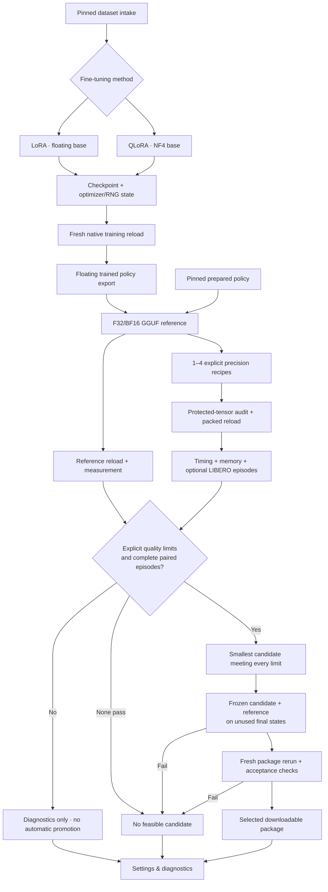

# Native policy workflow

OPEN JENSEN owns the project, dataset intake, jobs, cancellation, progress, artifact
lineage and downloads. Isolated Python 3.11/3.12 workers own ML/native execution. The core stays
on Python 3.14 without Torch. Web and CLI submit the same versioned API requests.

For SmolVLA, inspect a dataset, choose the model and **LoRA** or **QLoRA** in
**Fine-tune**, then select that checkpoint under **Quantize → SmolVLA**. This
quantization workflow also accepts a prepared, pinned policy source. **Evaluate**
and **Run → Check inference** accept the generated GGUF or package artifacts;
the latter can create a downloadable package after a fresh native reload.
**Distill** is the separate teacher-to-student training technique described
[below](#distillation), with an explicitly selected supported model family. See the
[workspace guide](workspace-guide.md) for all destinations.

Open each saved job for metrics, recipes, provenance, stage events and outputs.
**Settings & diagnostics → Diagnostics** provides separate policy checks and
benchmark references; **Workflow settings** holds advanced recipes and acceptance
constraints. Browser preferences are per project, and each job preserves its
submitted recipe on the server.

Diagnostics also shows the completed GPU benchmark comparison as labelled reference
results, even before a project has policy runs. NVIDIA L4 (8 vCPUs / 32 GiB), NVIDIA
L4 (12 vCPUs / 48 GiB) and RTX 3070 have separate views, pinned to evidence commit
`e5866f0`. The L4 (8 vCPUs / 32 GiB) view
includes all ten candidates, process-to-first-action startup, cached runtime
initialization, sampled process VRAM, and paired success changes. Missing RTX runs
and VRAM appear as dashes. Labels contain only hardware details. These examples do
not populate project jobs or establish results for a new policy.

To run project diagnostics, select **Settings & diagnostics → Diagnostics**, choose
an execution target and a project GGUF policy, choose **Engine checks** or **LIBERO
task evaluation**, then click **Start diagnostics**. **Edit diagnostic settings**
opens the per-project warmup, repetitions, task and initial-state controls. Results,
status, stage events and cancellation are available under **Diagnostic runs**, and
completed runs remain visible after reload. A project without a GGUF policy links
to **Quantize** to create one. An unavailable API, missing runtime or missing
simulator is shown explicitly and blocks the relevant launch.

Engine diagnostics require a working native worker configured on the application
host through `FIREBIRD_RUNTIME_CONFIG`; these controls do not provision GPUs.
Workers added through **Check this machine** support fine-tuning only and cannot
run these diagnostics. Registering an operator-configured
target advertises its configuration, not a live hardware health check. Worker
startup failures are reported by the job. The retired benchmark rental and failed
RTX host are not available execution targets.

Project diagnostics evaluate **one native policy** using the application's protocol.
The application defaults to **LIBERO Object**; the recorded comparison uses
**LIBERO Spatial**. Select the matching suite and configure its required assets
before comparing scores. Spatial diagnostics require the full 280-step horizon
and explicit parity limits, as described in the Spatial workflow below.
They do not launch the ten-stack LeRobot/bitsandbytes/C++/vLLM/TensorRT-LLM comparison,
whose complete observation-to-action timing, process memory and paired fixture
contract differ. **Measurement scope & reproduction** in the example links to the
pinned standalone GPU benchmark setup and commands for reproducing that comparison.

For the pinned newer Spatial policy, use the [Spatial optimizer workflow](spatial-workflow.md).
It keeps a native BF16 reference and floating C++ control separate, with explicit
parity admission before compression. Hardware acceptance is still pending.

## Distillation

Distillation trains a student policy to imitate a teacher policy. ACT means
**Action Chunking with Transformers**: it is a policy model family that predicts
robot action sequences, not the definition of distillation. Supporting another
family requires its own compatible adapter, teacher/student architecture handling
and observation/action mapping; training
support for a model does not imply distillation support.

The only implemented adapter is `act-act-v1`: a compatible ACT teacher trains a
smaller ACT256 student on a local CPU worker. Select **ACT** under **Supported
models** explicitly before preparing its teacher, verified local observations
and separate training, validation and final episode groups. The camera, saved processors, coordinate
order and units must match. SmolVLA, other model families and cross-family pairs
are not implemented. Results measure offline imitation and saved-policy reload,
not closed-loop task success. See [ACT adapter setup](../workers/policy_distillation/README.md)
and [local CPU worker setup](../workers/local_cpu/README.md).

## Cloud GPU setup

Connect Google Cloud once in **Settings & diagnostics → Compute**. Fine-tune then needs only
GPU selection and **Start fine-tuning**. Preparation happens automatically in
the queued run and stays pinned to its captured project, region, and server.
The L4, T4, and A100 picker is independent of transient preparation status.
Local training stays disabled unless explicitly enabled. Optional GPU defaults
and advanced preferences remain in Settings.
See [compute settings](compute-settings.md) and
[dispatch and recovery](skypilot-training.md).

## Defaults and selection

The SmolVLA form defaults to **20,000 optimizer steps and batch size 64**,
verified from KiteML’s signed-in training form on 2026-09-26 with
`codywang/so101_pickup_test`. OPEN JENSEN publishes **about five checkpoints total** to private GCS by default: every
4,000 optimizer steps for a 20,000-step run, including the final checkpoint.
The checkpoint count is editable.
The displayed step and batch defaults match KiteML. The existing LoRA/QLoRA
adapter keeps its own optimizer recipe. New UI runs have a 24-hour deadline.

The initial comparison candidate is **LM Q8_0 on CPU and CUDA**, with vision left
in its source precision. This starting point requires task-success validation.
LM Q4 and vision Q8 remain explicit experimental candidates. In the recorded
RTX 3070 pilot, C++ Q4 completed 8/20 tasks versus 15/20 for native BF16;
C++ Q8 matched all 20 reference episode outcomes. See the [comparison evidence](../workers/benchmark_gpu/README.md).
Those measurements do not establish packed-policy quality on L4 or on a new policy.

SmolVLA fine-tuning defaults to **LoRA**; **QLoRA** uses the same adapter training path over
an NF4 base. The method registry can grow without making QLoRA mandatory.

`GET /api/v1/policy-options` lists the training model catalog separately from
prepared native policy sources. It includes all 15 model choices observed in
KiteML, with pinned sources, supported methods, compatible `runtime_ids` and
availability status. SmolVLA uses LoRA/QLoRA; the other supported policies use
architecture-specific native training adapters. Historical OpenVLA entries remain
unavailable. See [model adapters and validation scope](native-training.md).

The bundled SmolVLA trainer uses `lerobot/smolvla_base` at revision
`d9f33c94a60fb382c90dea2164c96845bd955e28`. Each training run uses **one CUDA GPU**
with native BF16 on Ampere or newer, or scaled FP16 on T4; multi-GPU training is
not implemented. Other adapters have their own precision and memory constraints.
The selected model's `model_id` and `model_revision` are preserved in the request's
`training` recipe. Training requires a completed, pinned Hugging Face dataset
intake; local metadata inspection alone is not a supported input.

Cloud quantization publishes a representation-verified GGUF artifact. It does not
run the native evaluation/automatic promotion path below or establish task success.
Native non-SmolVLA checkpoints support training, resume and download; the GGUF
compiler currently supports SmolVLA only.



Engine diagnostics use synthetic inputs to test loading, finite actions, per-call
latency and memory. They never establish task success. LIBERO requires the explicit
`libero_object`/7-action compatibility declaration and a prepared simulator. An
SO-101 training dataset is not automatically compatible with LIBERO. Simulator
training overlap is not audited, and selected results describe only the requested
protocol, not robot readiness.

For automatic selection, enable paired LIBERO episodes and specify quality,
latency and memory limits. Search and final initial states must be disjoint. The
floating reference competes with packed candidates. The smallest passing weight
payload is frozen before final evaluation; a failed final check never silently
selects a replacement. GPU memory includes other device users; CPU memory samples
the process tree and may count shared pages more than once. Timing is engine
prediction latency, not control-loop latency. Small samples are diagnostic.

## Configure a local native execution host

Run the application on the machine that owns the workers/GPU. The web client can
be reached through an SSH tunnel; native requests never run arbitrary SSH or shell
commands.

For SmolVLA fine-tuning, install the
[pinned training environment](../workers/smolvla_qlora/docs/training/smolvla-qlora.md#install-on-the-training-machine)
under `workers/smolvla_qlora/.venv` in this source checkout. On Linux x86_64 with a
compatible NVIDIA GPU, open **Settings & diagnostics → Compute → Local runs**,
select **Check this machine**, then **Add worker**. Enable local runs and save
settings separately. The app checks its host's first visible GPU and installed
dependencies without downloads or jobs; it saves a training-only worker in
`local-workers.json`, leaving operator configuration untouched. See
[discovery scope and prerequisites](compute-settings.md#add-a-local-training-worker).

Discovery does not configure native export, quantization, evaluation or Run.
For these operations and other local worker adapters, install the workers
separately, following [quantization setup](../workers/vla_cpp/README.md)
and [pinned training setup](../workers/smolvla_qlora/docs/training/smolvla-qlora.md).
Use the patched, instrumented native build described in [GPU setup](../workers/vla_cpp/docs/gpu-setup.md).
Do not use an uninstrumented `vla-bench`: the adapter requires per-call samples.
Converting a trained checkpoint also requires the worker's `convert` extra (Torch
and safetensors) in the conversion environment, in addition to `quantize`. For
example, run `uv pip install --python .venv/bin/python -e '.[quantize,convert]'`
from `workers/vla_cpp`. Importing an existing GGUF and packing it do not need Torch.

Copy [runtime.example.json](runtime.example.json), replace every absolute path and
source SHA-256 with real values, and set `FIREBIRD_RUNTIME_CONFIG` before serving.
Without operator configuration or a registered managed worker, dataset intake
remains usable and policy execution stays unavailable.
A runtime without a training environment cannot advertise fine-tuning.

Optional `gpu_name` and `gpu_memory_mib` fields describe the GPU assigned to a
runtime. Replace the example specifications with your actual hardware, or omit
these fields when unknown. `gpu_memory_mib` must be a positive integer in MiB.
The public runtime includes both fields as `null` when unspecified. These are
operator-configured specifications, not live availability or free-memory readings.
Discovered workers instead record the checked GPU's name and total capacity;
neither path reports current free VRAM or provisions GPUs. Cloud training
uses the separate SkyPilot connection and provisioning path. `training_gpu_count` is `1`
for a CUDA runtime with a configured training environment, otherwise `null`. It
describes the current recipe's GPU count per run, not the host's GPU inventory.

```sh
export FIREBIRD_RUNTIME_CONFIG=/absolute/path/runtime-local.json
export FIREBIRD_DATA_DIR=/absolute/path/firebird-workspace
uv run --frozen firebird serve
```

Runtime configuration belongs to the local operator. HTTP requests can only select
registered IDs. `worker_root` points to `workers/vla_cpp`; `training_root` points
to `workers/smolvla_qlora`. `vendor`/`build` refer to the pinned native checkout and
build. `conversion_vendor` can point to a clean packed-loader checkout when the
measurement checkout also contains benchmark instrumentation. `tokenizer` is a
local pinned tokenizer directory. `LD_LIBRARY_PATH` must include the build's `bin`
directory when the native build puts shared libraries there.

An operator can install a different dataset-training adapter using
`training_module` (a Python module invoked with `python -m`) and
`training_model_ids` (catalog IDs). The defaults are `firebird_vla.application`
and `["smolvla"]`; the bundled module cannot advertise other architectures.
For example, an installed OpenVLA adapter could declare:

```json
{
  "training_module": "my_openvla_adapter.application",
  "training_model_ids": ["openvla"]
}
```

This is a worker registration, not an adapter installation. The module must exist
in the configured training environment and implement the existing application
request/result protocol, including `policy.finetune`, checkpoint manifests,
LoRA/QLoRA, dataset/camera validation, and export/resume operations when used.
The API rejects models outside that worker's declared list and pins every saved
new training recipe to the catalog checkpoint. Resumes resolve the model and
method from the checkpoint recipe or persisted lineage, preserve historical
pinned revisions, and leave a null resume recipe intact. It never accepts a module or executable
from the HTTP request. Availability means an operator has configured a CUDA worker;
it is not evidence of model quality or current GPU availability.

An optional `image` executes evaluation in Docker, using `python` as the image's
Python executable (often `python3`). Set `mounts` for the vendor/build/simulator and
other required paths; mounts preserve the same absolute paths. `conversion_python`
and optional `conversion_image` separate NumPy/GGUF conversion from a simulator
image with different dependencies. `training_python` and optional `training_image`
likewise isolate training. The operator must prepare these environments before
advertising them. The app serializes native jobs, but does not reserve the GPU from
other applications. Free-memory preflight is an estimate, not a guarantee.

## CLI and persistence

```sh
uv run --frozen firebird policy options
uv run --frozen firebird policy submit PROJECT_ID recipe.json
uv run --frozen firebird jobs show JOB_ID
uv run --frozen firebird jobs events JOB_ID
uv run --frozen firebird policy artifacts PROJECT_ID
```

Example `recipe.json`:

```json
{
  "operation": "policy.workflow",
  "runtime_id": "rtx3070",
  "source_id": "smolvla-libero",
  "candidates": [{"language": "Q4_0"}, {"language": "Q8_0"}],
  "evaluation": {"mode": "engine", "warmups": 3, "repetitions": 10}
}
```

This request produces diagnostics and retains all candidates. Training uses
`policy.finetune`, `dataset_job_id`, `training_method` and an optional `training`
recipe. A workflow can instead take a training recipe or a project checkpoint
artifact. `policy.export` materializes the actual trained base plus adapters before
GGUF conversion; QLoRA exports its dequantized NF4 base, never the pristine base
with an adapter accidentally omitted.

Job directories retain stage requests, bounded logs, reports and hashed bundles.
Downloads revalidate the registered inventory. Cancel stops the native process
group or Docker container before returning. Restart marks unfinished jobs
interrupted. Resume explicitly selects an interrupted job's last complete checkpoint
and preserves its original recipe, dataset, optimizer, scheduler, RNG and batch
cursor in a new output directory. Completed recipes cannot be resumed as if unfinished.
After a hard kill, an orphan worker/container may still be running. Recovery does
not adopt its late output or reuse persisted PIDs. Verify and stop that specific
orphan before resuming GPU work; ordinary cancellation and shutdown clean up workers.

All execution remains local and single-owner. Windows GPU and robot deployment
acceptance remain separate gates. See [validation evidence](workflow-validation.md)
for what was actually executed on this integration branch.

## Job history and creation

Fine-tune and Evaluate open saved jobs before their new-job forms. Quantize
first offers **SmolVLA** and **ACT** cards; Run offers **3D simulation**, **Replay
observations** and **Check inference**, restoring the project's selected workflow
and saved work. Engine workflows keep separate history, creation and result views;
native workflows show saved results alongside a separate preparation disclosure.
Select a saved job to inspect its status and evidence, or open its new-job action.
Logs and technical details remain behind disclosures while measured results stay
visible.

A dataset's **Train on this dataset** action opens a new fine-tuning form with
that dataset selected. A saved training checkpoint's **Quantize** action opens a
new quantization form for that exact checkpoint. Returning to Fine-tune through
the sidebar opens its history. Moving temporarily to Compute settings preserves
the training draft. Model-card memory labels describe GPU budgets, not file download sizes.
