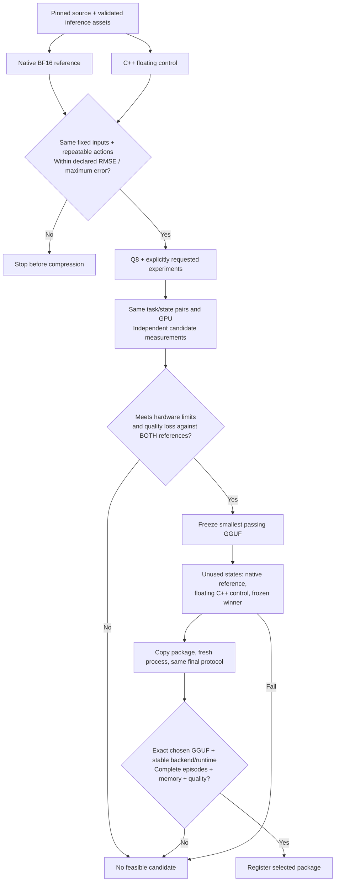

# Spatial optimizer workflow — software gates, hardware acceptance pending

This lane integrates the pinned `lerobot/smolvla_libero` policy with LIBERO Spatial.
It preserves the older Object adapter as a separate suite. Software tests use
synthetic subprocess fixtures; they do not establish L4 quality, memory savings,
latency or a deployable robot capability. L4 access, resource budget, final-state
approval and measured acceptance remain pending.

## Configure and submit

Use the [Spatial runtime template](runtime.spatial.example.json). Replace every
absolute path and placeholder digest with inspected local values. `evaluation_python`
selects a prepared Python 3.11 simulator/native-policy environment; optional
`evaluation_image` runs the same fixed `policykit.application` module in Docker.
The application still owns jobs, cancellation, evidence and artifact registration.
No request can inject a shell command or an arbitrary worker module.

The source must declare `task: libero_spatial` and a local `evaluation_bundle`
plus SHA256 of its `spatial-assets.json`. The bundle contains the exact native
reference weights, pinned tokenizer/processors, normalization and observation
configuration, fixed raw observation/noise fixtures, and asset provenance. The
worker owns bundle content validation. The source GGUF has a separate hash. The
native weight anchor and original floating GGUF identity survive quantization;
each packed model records its own current GGUF hash. An SO-101 policy or arbitrary
training checkpoint cannot enter this lane by changing a task label.

In **Settings & diagnostics**, choose **LIBERO Spatial**, task IDs, and paired
search/final states. Omitted API `task_ids` means all ten tasks (0–9); Object uses
its existing single `task_id` and rejects `task_ids`. Spatial defaults to a 280-step
horizon and 50 replayed actions. Shortened unsuccessful episodes cannot qualify as
complete task-quality evidence. The episode count is tasks × states, not states
alone. Seeds are `seed + state`; noise starts at `seed + 1000 × state`.

A Spatial workflow requires an explicit `evaluation.parity_limits` object with
`profile`, `max_rmse`, and `max_abs_error`. Choose and review these values for the
fixed observation-to-action fixtures before running; no universal tolerance or
empirically approved threshold is supplied by the software. The UI leaves them
blank until entered. Synthetic tests use exact-zero tolerances only for synthetic
identical actions. These are not recommended real-model tolerances.

Q8 is the initial packed candidate. Q4 and vision packing require explicit choices.
Automatic selection additionally requires LIBERO mode and `limits`; existing
finite quality, latency and memory constraints apply. Without selection constraints,
the workflow retains diagnostic evidence and does not promote a package.

## Gates and comparison identities



Native BF16 and C++ runtime identities remain distinct. Native results provide a
quality reference; they never become a C++ candidate's score. Repeated runs of the
same backend require an unchanged runtime fingerprint. Cross-backend comparisons
require the same GPU UUID/name/driver, canonical protocol and exact episode IDs.
The protocol includes task/state IDs, seed/noise schedule, action replay, pinned
inference assets, simulator identities, fixed fixture hashes and timing settings.

The floating C++ control must pass action parity before any packed candidate is
created. Core independently computes RMSE and maximum absolute error from complete
finite 50 × 7 action chunks with matching fixture hashes and repeatability evidence.
The control is also a candidate, but every candidate must retain quality relative
to both the native and C++ references. Reference measurements may exceed the user's
deployment memory/latency budget; only the selected candidate must fit it.

The frozen candidate is evaluated alongside fresh native and floating C++ controls
on disjoint final states. A failed final gate never chooses a replacement. The
materialized package is then rerun; its report must match final protocol/hardware,
the chosen backend runtime, action fixture evidence, and exact GGUF/native lineage
hashes. If the floating control wins, export removes only its reference-only native
weights and updates the corresponding asset inventory before testing. Core independently
rederives that transformation and the tested manifest hash; all remaining asset bytes
must match. Packed candidates retain their pre-export inventory exactly. The package
is not registered if core acceptance rejects its report.

## Software evidence

`tests/test_spatial_workflow.py` uses a separate explicitly synthetic worker. It
checks suite admission, task counts, fixed environment selection, parity failure
before compression, native-versus-C++ identity separation, wrong model/protocol,
duplicate episodes, missing telemetry, quality loss against both controls, final
failure without replacement and rejected packages remaining unregistered.

Run these gates together with legacy lifecycle regressions:

```sh
uv run --frozen pytest -q tests/test_spatial_workflow.py tests/test_lifecycle.py
```

Local software validation on the branch based on `0c3fcbc`: **88 passed**
(25 Spatial gates plus 63 legacy lifecycle tests), no skips. Focused Ruff checks
and formatting pass. One existing Starlette test-client deprecation warning remains.
The new browser request-payload regression requires the integrated frontend build
and regenerated API client; it is not included in that Python count.

Real acceptance still requires the pinned worker environment on the dedicated L4,
validated preprocessing/normalization, approved parity/quality thresholds, measured
resource coverage, and the final exact-package rerun. No hardware result is inferred
from these tests or copied from historical benchmark reports.
