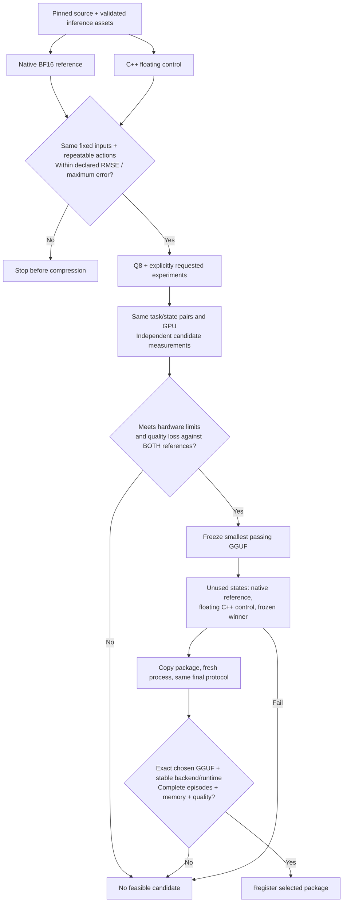

# LIBERO Spatial optimizer workflow

This lane integrates the pinned `lerobot/smolvla_libero` policy with LIBERO Spatial.
It preserves the Object adapter as a separate suite. The workflow requires
prepared inference and simulator assets, a compatible GPU, and explicit action
parity and quality thresholds. Configuration alone does not establish task
quality, memory savings, latency or robot deployment compatibility.

## Validate local assets before GPU work

The offline preflight checks an already prepared reference bundle and its paired
floating GGUF. Run it from the application checkout with the existing Python 3.11
worker environment (`quantize` and `test` extras provide GGUF, NumPy and
safetensors without Torch). Dependency installation is a separate setup step;
`--offline --frozen` below requires those dependencies to be available locally.
Replace the paths and both expected SHA256 values with the inspected source
identities, not hashes of a newly substituted candidate:

```sh
uv run --offline --frozen --project workers/vla_cpp --extra quantize --extra test \
  python -m policykit.spatial_preflight \
  --bundle /local/spatial-bundle \
  --bundle-sha256 EXPECTED_SPATIAL_ASSETS_JSON_SHA256 \
  --gguf /local/smolvla-bf16.gguf \
  --gguf-sha256 EXPECTED_FLOATING_GGUF_SHA256
```

The command only reads local files and emits one versioned JSON receipt on stdout.
Exit zero means `static_assets_verified`; validation failure emits `status: failed`
and exits one. It never writes a receipt over an input file. The receipt identifies
both source hashes, the full asset inventory, fixed fixture hashes, validator code,
Python, dependency versions and the source checkout's worker lock when present.
Keep inputs unchanged while inspecting them. Model identities are streamed hashes;
the checker does not deserialize the native policy or execute the GGUF.

The shared checks require a floating F32/BF16 SmolVLA source, its pinned native
weight and backbone identities, exact 8-state/7-action normalization, 50×32 padded
actions, ten denoising steps and the declared image layout. Packed GGUF candidates
cannot serve as the floating reference. Required normalization vectors must be
finite F32 and match exactly; negative standard deviations fail, while zero values
retain the processor's existing epsilon semantics. Additional serialized processor
statistics are allowed within a 1 MiB file and 64 KiB metadata bound.

Every fixed NPZ is checked before array allocation: exact field names, shapes,
dtypes, finite values, RGB bounds, one bounded Unicode task and no pickle. Each
archive is capped at 16 MiB both compressed and expanded; the existing fixture-set
limit is 64 unique fixtures and 256 MiB compressed total. Header validation and
decoding use the same immutable bytes, bound to the inventory hash, so replacing
a pathname between those operations cannot bypass the bounds. Normalization
files use the same snapshot approach. Duplicate entries, oversized declared shapes,
corrupt bytes and changed identities fail validation.

The existing [local bundle preparation command](../workers/vla_cpp/docs/spatial-application.md#prepare-exact-local-assets)
runs these same checks in a private sibling staging directory. It publishes
the requested output only after success and prints the final manifest digest.
Publication refuses any existing destination, including one created during
preparation, and failure removes only its own staging directory. Inputs and other
staging directories remain unchanged. Atomic no-replace publication uses the
platform's native operation on Linux, macOS and Windows; unavailable operations
fail closed. Windows publication requires separate platform checks.

`static_assets_verified` is deliberately limited to hashes, declared GGUF layout,
normalization and fixture arrays. The receipt marks **GPU, runtime, episodes,
authorization, action parity and model loading as not checked**. It does not prove
a complete executable weight inventory or confer selection/deployment eligibility.
Preparing simulator assets, capturing observations, choosing thresholds, and
running the GPU evaluation protocol are separate steps.

## Configure and submit

Use the [Spatial runtime template](runtime.spatial.example.json). Replace every
absolute path and placeholder digest with inspected local values. `evaluation_python`
selects a prepared Python 3.11 simulator/native-policy environment; optional
`evaluation_image` runs the same fixed `policykit.application` module in Docker.
The application still owns jobs, cancellation, evidence and artifact registration.
No request can inject a shell command or an arbitrary worker module.

The source must declare `task: libero_spatial` and a local `evaluation_bundle`
plus SHA256 of its `spatial-assets.json`. The bundle contains the exact native
reference weights, pinned tokenizer/processors, normalization and observation
configuration, fixed raw observation/noise fixtures, and asset provenance. The
worker owns bundle content validation. The source GGUF has a separate hash. The
native weight anchor and original floating GGUF identity survive quantization;
each packed model records its own current GGUF hash. An SO-101 policy or arbitrary
training checkpoint cannot enter this lane by changing a task label.

In **Settings & diagnostics → Workflow settings**, choose **LIBERO Spatial**, task IDs, and paired
search/final states. Omitted API `task_ids` means all ten tasks (0–9); Object uses
its existing single `task_id` and rejects `task_ids`. Spatial requires paired LIBERO
mode and the full 280-step horizon, with 50 replayed actions. Engine mode and shortened
horizons are rejected before creating a job. The UI selects and locks these settings;
saved older Spatial preferences are migrated to the supported protocol. Complete
episodes require at least one executed step; success may finish early, but an
unsuccessful episode must reach the full horizon. The episode count is tasks × states, not states
alone. Seeds are `seed + state`; noise starts at `seed + 1000 × state`.

A Spatial workflow requires an explicit `evaluation.parity_limits` object with
`profile`, `max_rmse`, and `max_abs_error`. Choose and review these values for the
fixed observation-to-action fixtures before running; no universal tolerance or
empirically approved threshold is supplied by the software. The UI leaves them
blank until entered. Choose thresholds for the selected model and observations.

Q8 is the initial packed candidate. Q4 and vision packing require explicit choices.
Automatic selection additionally requires LIBERO mode and `limits`; existing
finite quality, latency and memory constraints apply. Without selection constraints,
the workflow retains diagnostic evidence and does not promote a package.

## Gates and comparison identities



Native BF16 and C++ runtime identities remain distinct. Native results provide a
quality reference; they never become a C++ candidate's score. Repeated runs of the
same backend require an unchanged runtime fingerprint. Cross-backend comparisons
require the same GPU UUID/name/driver, canonical protocol and exact episode IDs.
The protocol includes task/state IDs, seed/noise schedule, action replay, pinned
inference assets, simulator identities, fixed fixture hashes and timing settings.

The floating C++ control must pass action parity before any packed candidate is
created. Core independently computes RMSE and maximum absolute error from complete
finite 50 × 7 action chunks with matching fixture hashes and repeatability evidence.
Core binds the entire inference-asset inventory to the registered artifact and requires
all fixed inputs listed in its hashed `spatial-assets.json`, exactly once, for every
reference, candidate, final run and package rerun. Two matching but incomplete or
unrelated worker claims cannot satisfy the parity gate.
The control is also a candidate, but every candidate must retain quality relative
to both the native and C++ references. Reference measurements may exceed the user's
deployment memory/latency budget; only the selected candidate must fit it.

The frozen candidate is evaluated alongside fresh native and floating C++ controls
on disjoint final states. A failed final gate never chooses a replacement. The
materialized package is then rerun; its report must match final protocol/hardware,
the chosen backend runtime, action fixture evidence, and exact GGUF/native lineage
hashes. If the floating control wins, export removes only its reference-only native
weights and updates the corresponding asset inventory before testing. Core independently
rederives that transformation and the tested manifest hash; all remaining asset bytes
must match. Packed candidates retain their pre-export inventory exactly. Export may
add only `reload-verification.json`, `runtime-lock.json`, `tested-payload.json`,
`workflow-evidence.json` and `lineage.json`; additional runtime assets are rejected.
The package
is not registered if core acceptance rejects its report.

## Local checks

Run the Spatial and lifecycle contract checks from the application checkout:

```sh
uv run --frozen pytest -q tests/test_spatial_workflow.py tests/test_lifecycle.py
```

GPU evaluation requires the pinned worker environment, compatible hardware,
validated preprocessing/normalization, explicit parity/quality thresholds,
resource telemetry, and the final exact-package rerun described above.
