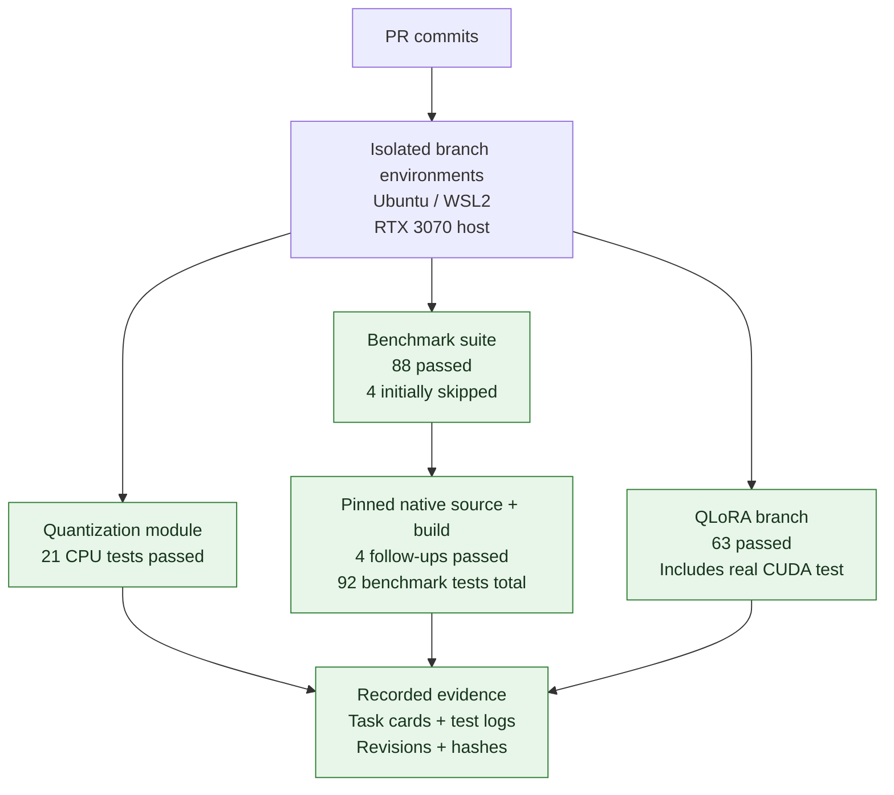
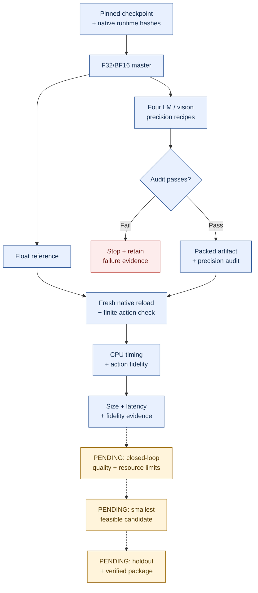

# Standalone SmolVLA quantization module

This checkout also includes the CPU benchmark layer. Its PR is
`feat/quantization_benchmark_cpu` → codebase `main`, with the quantization module
PR merged first; see
[CPU reproduction and evidence](docs/cpu-benchmark.md). The module API and
`policykit-worker` command below remain available. The added `policykit` command
runs the historical experiment harness.

This package converts an F32/BF16 SmolVLA GGUF into LM Q8_0/Q4_0, optionally with
vision Q8_0, while preserving the action expert, projectors, embeddings, norms and
other protected tensors. It includes the pinned vla.cpp packed-weight loader patch
and a versioned subprocess worker. It has no dependency on the OPEN JENSEN core.

The implementation branches target `main` in `firebird-hackathon-codebase`.
`feat/quantization_module` provides the shared worker; CPU benchmarking and RTX 3070
experiments depend on it. Training lives in `workers/smolvla_qlora` on
`feat/qlora_module`. The integration branch connects these workers through `vla_platform.lifecycle`
and shared project jobs; see the [application workflow](../../docs/policy-workflow.md)
and [integration evidence](../../docs/workflow-validation.md). The standalone
quantization protocol remains available for experiments.

Related task: [QUANT-001 (#24)](https://github.com/sobhanb-eth/firebird-hackathon-codebase/issues/24).

## Experimental CUDA and NVIDIA quantization

The `feat/quantization-rtx3070` PR targets codebase `main` and depends on the
quantization module PR. It relates to [QUANT-001 (#24)](https://github.com/sobhanb-eth/firebird-hackathon-codebase/issues/24)
and [EVAL-002 (#21)](https://github.com/sobhanb-eth/firebird-hackathon-codebase/issues/21). It adds isolated CUDA engine/rollout tools
and small ModelOpt AWQ/SmoothQuant pilots. Start with the
[GPU setup](docs/gpu-setup.md), [RTX 3070 results](docs/quantization-rtx3070.md)
and [NVIDIA research plan](docs/nvidia-quantization-plan.md).

The recorded experiment completed 300 CUDA predictions and one paired LIBERO
development episode per candidate. Four candidates succeeded; LM Q4 plus vision
Q8 reached the natural horizon without success. ModelOpt calibration produced
finite actions but both full-policy exports failed. The evidence predates this
source import; `GPU_ORIGIN.json` records the import changes. Broader quality,
packed ModelOpt execution and verified deployment packages remain open.

## Application acceptance

The [native acceptance contract](docs/native-acceptance.md) describes the repaired
GGUF checks, complete memory coverage, Linux runtime fingerprints and fresh-process
package verification. Its CPU regressions are separate from hardware/model evidence.
The separate [LIBERO Spatial adapter](docs/spatial-application.md) shares the
native/CPP observation implementation, verifies offline policy assets and uses
paired native BF16/floating controls. Hardware acceptance remains a required run.

## Testing and benchmarking

The [application workflow diagram](../../docs/policy-workflow.md#defaults-and-selection)
shows the connected training, reference/candidate measurement, final evaluation and
package reload path. The historical branch evidence below has its own scope; it
must not be confused with the new [integration checks](../../docs/workflow-validation.md).

We validate the implementation first, then measure actual model artifacts. These
are separate evidence stages: passing code tests does not establish model quality,
GPU throughput or deployment readiness.

### Branch tests — verified on September 26, 2026



Quantization and benchmark checks run on CPU; the tiny QLoRA test exercises CUDA.
The 92 benchmark tests include the module checks; do not add 21 and 92 as unique
tests. Four initially skipped native checks passed in follow-up runs, including
two compiled-loader checks in a Linux container. The QLoRA GPU test uses a tiny
synthetic policy, not a full SmolVLA training run. See the
[RTX 3070 execution report](https://github.com/sobhanb-eth/firebird-hackathon-prep/blob/edd9fb00d234bd350b566ad66d1a92551bf67a35/docs/tasks/evidence/2026-09-26-rtx3070-validation.md)
for commands, tested commits and the corrected container library-path failure.

### Model benchmarks — recorded CPU diagnostics, then pending product gates

The benchmark implementation lives on `feat/quantization_benchmark_cpu`. Blue
nodes below describe the existing CPU experiment flow and historical evidence;
they were not rerun with full model weights during the RTX 3070 test session.
Dashed arrows lead to pending product validation. CPU measurements use matched
synthetic inputs, warmups, repeated runs and balanced ordering; action fidelity
compares real control channels against the floating reference. Candidate selection
must report explicitly when none meets the quality, memory and latency limits.



The historical floating timing control drifted by **25.6%**, so those measurements
do not establish a reliable quantization speedup. Numerical action agreement is
not task success. Module output remains `conversion_only` with
`deployment_verified: false`; the legacy selector cannot certify the pending
product gates. See the benchmark branch's
[CPU protocol and evidence](https://github.com/sobhanb-eth/firebird-hackathon-codebase/blob/feat/quantization_benchmark_cpu/workers/vla_cpp/docs/cpu-benchmark.md).

## Install

Run inside `workers/vla_cpp` with Python 3.11 or 3.12:

```sh
uv sync --locked --extra quantize --extra test
uv run policykit-worker --help
uv run python -m pytest -q
```

The benchmark container builds from this directory and runs `policykit`.
The standalone conversion entry point remains `policykit-worker`. Mount a
prepared native checkout, floating checkpoint and writable job/output directory;
the image does not download models or build a native inference runtime.

## Native preparation and contract

Prepare vla.cpp at commit `52439f7c6c362d7bee218b400b9080cc32d75cc3` and apply
`policykit/patches/vla-cpp-smolvla-packed.patch`. The same patch ships in installed wheels as a package resource. Then inspect the exact runtime identity:

```sh
uv run policykit-worker --describe-runtime /absolute/path/to/vla.cpp
```

The returned identity contains the native commit, actual patch hash, upstream
quantizer hash, this package's Python-source hash, and installed NumPy/GGUF versions.
Unexpected native edits fail preparation. Resolve the identity again after changing
worker code or dependencies; identities from another branch are not interchangeable.

A caller writes `job.json` inside a unique output directory and invokes:

```sh
uv run policykit-worker --job /absolute/path/to/run/job.json
```

Version-one envelope:

```json
{
  "schema_version": 1,
  "run_id": "run-example",
  "attempt_id": "attempt-1",
  "output_dir": "/absolute/path/to/run",
  "recipe_sha256": "SHA256_OF_CANONICAL_RECIPE_JSON",
  "recipe": {
    "schema_version": 1,
    "operation": "policy.quantize",
    "backend": "vla_cpp_smolvla",
    "policy": {"architecture": "smolvla"},
    "source": {"path": "/absolute/path/to/float.gguf", "sha256": "SOURCE_SHA256"},
    "runtime": "REPLACE_WITH_DESCRIBE_RUNTIME_OBJECT",
    "target": "local-cpu-conversion",
    "language": "Q4_0",
    "vision": "Q8_0"
  }
}
```

The example contains placeholders. Canonical JSON uses sorted keys, separators
`(',', ':')`, and `allow_nan=False`; hash its UTF-8 bytes. Callers should also carry
checkpoint revision and observation/action semantics in `policy`; the worker checks
the architecture and source bytes, while the application owns semantic admission.
Use `null` for `vision` to retain its original precision.
All input tensors must be F32 or BF16. F16 tensors, including F16 in protected
groups or mixed-precision masters, are rejected before conversion because the
pinned converter and native loader do not consistently support them.

The worker checks source/runtime identity before and after packing, checks tensor
shapes/precisions and unchanged protected values, and atomically publishes
`bundle/`. It writes `events.jsonl`, `result.json`, a precision audit, hashes,
lineage, packed-weight bytes and GGUF bytes. Failure returns a nonzero exit code.
Callers own scheduling, timeout, cancellation, persistence and artifact registration.
An abruptly killed worker can leave an unpublished staging directory for inspection.

For direct experimental use, `policykit-quantize --in ... --out ...
--vendor-script ... --type Q4_0 --vision-type Q8_0` exposes the original quantizer.
Use the worker for identity checks and atomic publication; the direct CLI writes
its output and audit directly.

## Evidence boundary

Output is `quantized_weights` with `evidence_scope: conversion_only`, null task
success and `deployment_verified: false`. It is not a deployment selection or a
complete policy package. Native checkpoint conversion, QLoRA adapter merging,
training, inference benchmarks and closed-loop evaluation are separate operations.

The module tests perform real packing of small synthetic GGUF tensors, verify all
four precision recipes and protected values, and reject changed inputs/runtime
identities without publishing a bundle. Their minimal test decoder is not evidence
of a complete SmolVLA inference runtime. CPU model evidence belongs to the benchmark
PR; CUDA and robot-task quality require separate validation.
