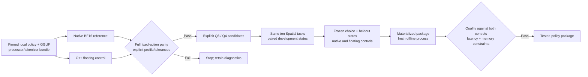

# LIBERO Spatial application adapter (EVAL-003)

The application can evaluate the pinned `lerobot/smolvla_libero` policy through
native PyTorch BF16 and the patched C++ floating/Q8/Q4 runtimes using one shared
observation-to-action implementation. This is a separate adapter from the
historical LIBERO Object lane. Neither lane demonstrates SO-101 pickup control.
CPU tests establish contract and rejection behavior only. No new GPU, simulator
quality, latency, memory or hardware acceptance result is asserted here.

## Supported scope and workflow



The source adapter is intentionally limited to one pinned SmolVLA checkpoint.
It is not a generic VLA converter or a Spatial fine-tuning implementation. The
existing component allowlist still preserves the action expert and other
protected tensors. Q4 must be explicitly requested. A runtime remains an
externally prepared Linux CUDA environment; it is not embedded in the package.

The core orchestration owns the stages `native-reference`, `baseline`,
`quantize-i`, `evaluate-i`, `final-reference`, `final-control`, `final-evaluation`
and `package-and-reload`. The worker accepts `policy.evaluate` with internal
`evaluation_backend: native-bf16|cpp`. Users specify `evaluation.suite:
libero_spatial`, optionally `task_ids` (omitted means all ten), disjoint
`initial_states` and `final_states`, and an explicit `parity_limits` object with
`profile`, `max_rmse` and `max_abs_error`. No numerical tolerance is invented by
the worker. Core compares every finite 50×7 fixture action before compression.

## Prepare exact local assets

Use a separately prepared Python 3.11 environment with the pinned
[benchmark native requirements](../../benchmark_gpu/requirements-native.txt),
plus the native worker's `quantize` extra. The application runtime's
`evaluation_python`/`evaluation_image` selects this environment; conversion and
quantization environments stay independently configured. Use the worker source
checkout as `worker_root` so its source and lock are available for fingerprinting.
This integration does not install a GPU stack, provision a VM or download weights.

The local snapshots must already exist with these exact directory names:

| Resource | Snapshot revision |
|---|---|
| `lerobot/smolvla_libero` | `31d453f7edd78c839a8bbc39744a292686daf0de` |
| `HuggingFaceTB/SmolVLM2-500M-Video-Instruct` | `7b375e1b73b11138ff12fe22c8f2822d8fe03467` |
| `lerobot/libero-assets` | `0b3ea86be5fe169d0fd036ae63d1070ec09e90f6` |

Native weights must have SHA256
`9a9f6413e42c0f332fccbce9a0dc796af2790f82cf002f791cdbf7e01e1afca8`.
The converter's state dimension must be corrected to eight while preserving the
original checkpoint. The reviewed [conversion adjustment](../../benchmark_gpu/evidence/2026-09-26/conversion-adjustment.json)
records the original and derived config hashes. Before evaluation the worker
checks GGUF `real_state_dim=8`, `max_state_dim=32`, ten denoising steps, action
layout 50×32 padded / seven real channels, and 512px model images. It compares
all eight state and seven action mean/std values directly against the packaged
normalization tensors. Truncating gripper coordinates or using identity stats
fails this check. The [pinned upstream converter](https://github.com/VinRobotics/vla.cpp/blob/52439f7c6c362d7bee218b400b9080cc32d75cc3/scripts/convert_smolvla_to_gguf.py)
reads the state dimension from config, making that correction necessary.

Prepare from already captured fixed raw observation/noise NPZ fixtures and the
paired floating GGUF (replace example paths with existing local paths):

```sh
python -m policykit.spatial_protocol \
  --policy /local/snapshots/31d453f7edd78c839a8bbc39744a292686daf0de \
  --backbone /local/snapshots/7b375e1b73b11138ff12fe22c8f2822d8fe03467 \
  --fixtures /local/frozen-fixtures \
  --gguf /local/smolvla-bf16.gguf \
  --output /local/new-spatial-bundle
```

The command copies approved assets and prints the SHA256 of
`spatial-assets.json`. Supply the output directory as `source.evaluation_bundle`
and that digest as `source.evaluation_bundle_sha256`, alongside source GGUF path,
SHA256 and `task: libero_spatial`. It never downloads files. The historical
benchmark CLI can capture fixtures in a separately authorized GPU run; that is
not done by this preparation command. Synthetic observations measure execution
and numerical parity only, never task success.

`spatial-assets.json` inventories policy config, both processor pipelines, their
two normalization safetensors, backbone config/processor/tokenizer assets and
1–64 unique NPZ fixtures. Reference bundles additionally contain
`policy/model.safetensors`; no backbone model weights are required. Paths,
symlinks, extra/missing files, changed hashes and duplicate fixture content are
rejected. Fixtures are bounded to 256 MiB compressed total and 16 MiB expanded
per archive, with exact numeric arrays, no executable pickle, two RGB FP32
360×360 images, eight state coordinates and FP32 1×50×32 noise.

Use `runtime.simulator_lane` for the existing prepared LIBERO config directory
containing `config.yaml` and `assets.json` from
[`prepare_libero_assets.py`](../../benchmark_gpu/scripts/prepare_libero_assets.py).
Preparing that directory can download simulation assets and is a separate
operator action. The configured asset snapshot must match its recorded pinned
revision. Each run hashes actual BDDL, initial-state and simulation asset files.
The native build needs `vla-server`, `vla-bench` and `tests/vla_predict_check`;
`runtime.vendor` needs its serving protobuf and reviewed packed-loader patch.
The selected target is NVIDIA GPU index 0; use an unmasked device or a matching
`CUDA_VISIBLE_DEVICES` mapping. A different mapping fails telemetry coverage.

## Comparable inputs, distinct runtime identity

The [LeRobot 0.4.4 environment](https://github.com/huggingface/lerobot/blob/v0.4.4/src/lerobot/envs/libero.py)
sets Spatial's natural horizon to 280 and ordinarily wraps initial-state indices.
This adapter checks the requested state exists before reset and rejects
wraparound. It runs an independent one-environment rollout for every requested
task/state pair. A failed episode needs all 280 steps; early successes retain
their actual step count. Episode seeds are `seed + state`; chunk noise seeds
are `seed + 1000 * state + chunk_index`. Each policy chunk replays 50 actions.

The benchmark script and application both call
[`spatial_runtime.py`](../policykit/spatial_runtime.py): local LeRobot
pre/postprocessors, identical images/tokenizer/state/noise inputs, ten denoising
steps and complete unnormalized CPU actions. C++ uses the same verified stats
inside GGUF. No additional gripper threshold is introduced.

`protocol_sha256` is SHA256 of canonical sorted compact JSON. The protocol
contains suite, sorted task and phase-specific state IDs, exact episode tuples,
seed/horizon/action length, noise/preprocessing layout, fixture and inference
asset hashes, simulator identity and timing/parity settings. It excludes model
precision, model/output paths and native reference weight inventory. Therefore
native and C++ inputs compare identically while development and heldout states
have different protocol hashes.

Reports separately identify backend family (`native-bf16` or `cpp`), configuration
(`native-bf16`, `cpp-bf16`, `cpp-Q8_0`, `cpp-Q4_0`, optional `-vision`), physical GPU
UUID/name/driver, adapter runtime fingerprint and actual inference child runtime.
The latter includes Linux ELF libraries loaded by the Python ML process plus the
existing binary/build-library/worker/lock/environment fingerprints. Package
versions are recorded; arbitrary third-party Python source is not attested.
Within a backend the complete runtime identity must stay stable across phases.
`cpp-bf16` names the floating control; its GGUF may retain protected F32 tensors.

Every timing fixture reports all 50×7 actions and requires exactly repeated
inference for the same input/noise. Timing includes raw CPU observation through
preprocessing, transfer/RPC, inference and unnormalization; it excludes simulator
stepping and camera acquisition. Timing samples are finite and strictly positive.

## Memory and package acceptance

A supervisor samples only the inference process and its children, using GPU UUID
and process IDs, from startup through timing and every episode. It sums observed
per-process GPU allocations at intervals of at least 100 ms. Each phase waits for
a positive sample before advancing. Missing/nonfinite/zero telemetry leaves the
run unqualified; unrelated GPU processes are never substituted. Brief transients
between samples may still be missed. Timeout/error kills and reaps the process
group; diagnostics are capped at 64 MiB.

Packed candidates copy all inference assets and omit native reference weights.
If the floating control wins, export removes only its native reference weights
and updates the exact asset inventory before testing. `model_sha256` binds the
actual GGUF; `native_model_sha256` and `floating_model_sha256` preserve source
lineage. Core independently reconstructs the permitted floating-export inventory
change. The source artifact remains intact.

Export evaluates `package-pending` in a fresh process, whose inference child
receives only that package and an empty Hugging Face cache with both offline modes
enabled. It reloads local processors/tokenizer/config/GGUF, repeats heldout episodes
and returns the tested manifest/model hashes. No source-directory or warm-cache
fallback is supplied. The caller checks unchanged payload bytes, matching final
protocol/target/backend runtime, quality retained against **both** references and
all selected-policy hardware constraints. References may exceed the deployment
budget, but their evidence must be complete. Only then does the package receive
its evidence files and get renamed to `package`.

## Local evidence and remaining gates

Run from `workers/vla_cpp` with Python 3.11:

```sh
uv sync --locked --extra quantize --extra test
uv run --locked --extra quantize --extra test pytest -q -rs
```

Observed with the frozen Python 3.11 worker environment: **203 passed, 4 skipped**,
including **71 new Spatial CPU tests**. The skips require the prepared native
vendor source or Linux native integration. The benchmark CPU suite separately
passed four tests and skipped two tests needing Torch/LeRobot. These counts do
not establish actual policy execution or GPU acceptance.

The current CPU regression suite includes exact asset/copy/empty-cache reload,
raw fixture bounds, 6-to-8 state normalization, full-action parity evidence,
phase protocol/complete episodes, process-tree sampling/timeouts, outer-process
cancellation during inference and process creation, and application
report/package gates. The separate benchmark CPU tests check existing harness
contracts. GPU, full native loader and LeRobot model tests require their prepared
environments; expected skips are reported instead of treated as successes.

Still required before deployment claims: approved access to the dedicated GPU;
known unused device state and budget; actual pinned policy/fixture capture;
explicit parity tolerance review; paired full Spatial development and heldout
runs; positive complete memory/timing evidence; and a fresh offline exported
package run. This slice does not generate rollout videos, prove SO-101 control,
establish training-data independence, or claim reliable speedups/quality from
historical benchmark numbers.
